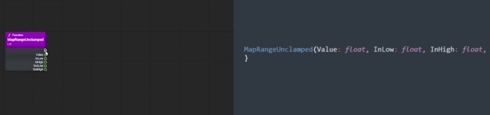
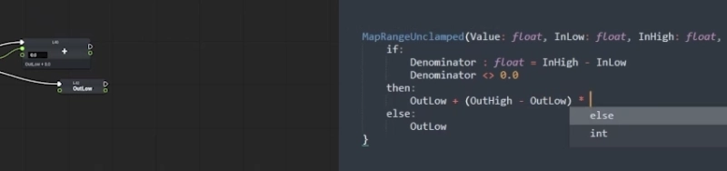
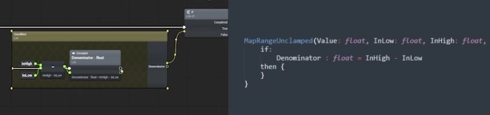
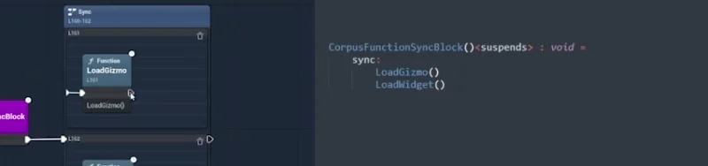

# Verse Visual Editor

Verse Visual Editor presents Verse code as a visual workspace inspired by Blueprint, that directly reads and writes regular Verse code so that you can work seamlessly with others who edit the text directly.

> [!CAUTION]
> **Verse Visual Editor is in early development and is not yet ready for
> production use.**

## About

You're used to coding in Blueprints and you want to keep doing it. This editor is designed to preserve that workflow as much as possible, while letting you work along side text edits and take control of the full power of Verse.

[Watch the Verse Visual Editor overview](https://www.youtube.com/watch?v=sEqdGczNjIg)

You can load any Verse file, not just one made in a graph editor. You can edit code in the graph without affecting surrounding lines.



When other people update your Verse code it automatically updates the graph. You can merge your changes with those of other people.



You can see how Verse failable blocks work and author `<decides>` code directly from the graph. Write natural Verse `if` and `for` expressions.



You can write `<suspends>` functions natively and author `sync`/`race`/`rush`/etc code directly from the graph.



## Getting Started

Verse Visual Editor requires an Unreal Engine 6 main-branch source checkout
with Verse support and a game project that uses that checkout.

Clone the repository into the `Plugins` directory of your game project:

```text
cd <UE6-main>/<YourGame>/Plugins
git clone https://github.com/LunarWorkshop/VerseVisualEditor.git VerseVisualEditor
```

The resulting layout should be:

```text
<UE6-main>/
└── <YourGame>/
    └── Plugins/
        └── VerseVisualEditor/
```

Regenerate your game project files, build your game’s Editor target, and open
the project in Unreal Editor. Enable **Verse** and **Verse Visual Editor** for
the project if they are not already enabled, then restart the editor when
prompted.

## Contributing

Bug reports, documentation improvements, feature proposals, tests, and code
contributions are welcome. Please read [CONTRIBUTING.md](CONTRIBUTING.md) before
opening an issue or pull request.

## License

Verse Visual Editor is provided under the Fab Standard License. See
[LICENSE.md](LICENSE.md).
